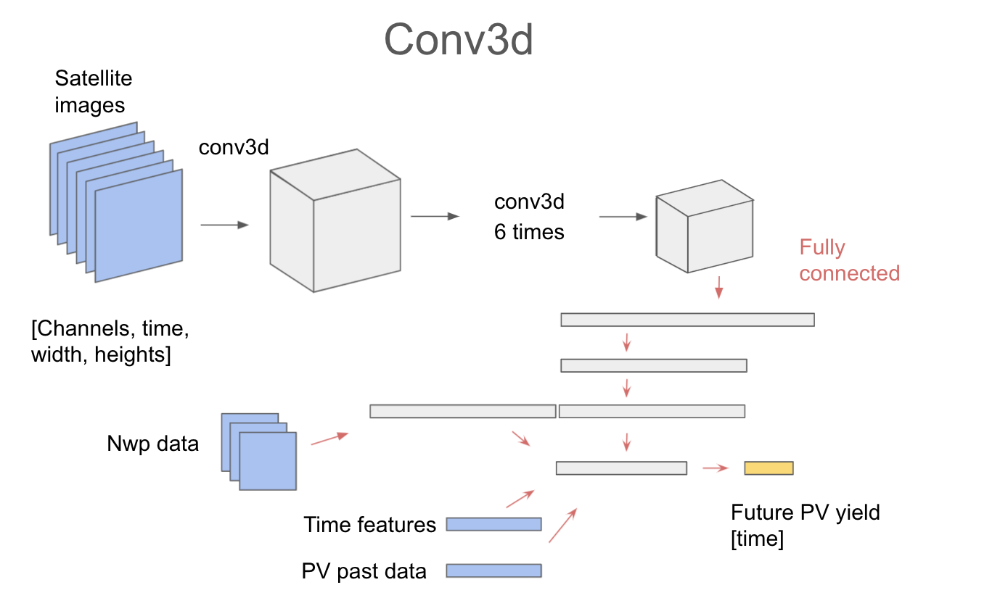

# Convolution 3d network

Idea is to use convolution 3d networks.

Satellite images go into several 3D convolution with no padding.
Then they are moved into a 2 fully connected layers.

NWP data, historic pv yield and time features are added to the fully connected layers.

Final outcome is PV yield for the future.

## Conv_nwp

We have built a model that takes nwp input data only.
This has several 3dd cnn layers and then a few fully connected layers.

The only nwp channel is `dswrf`

training run is https://app.neptune.ai/o/OpenClimateFix/org/predict-pv-yield/e/PRED-951/charts
